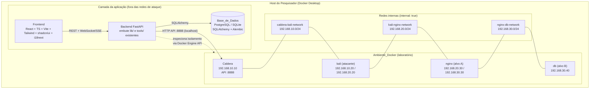
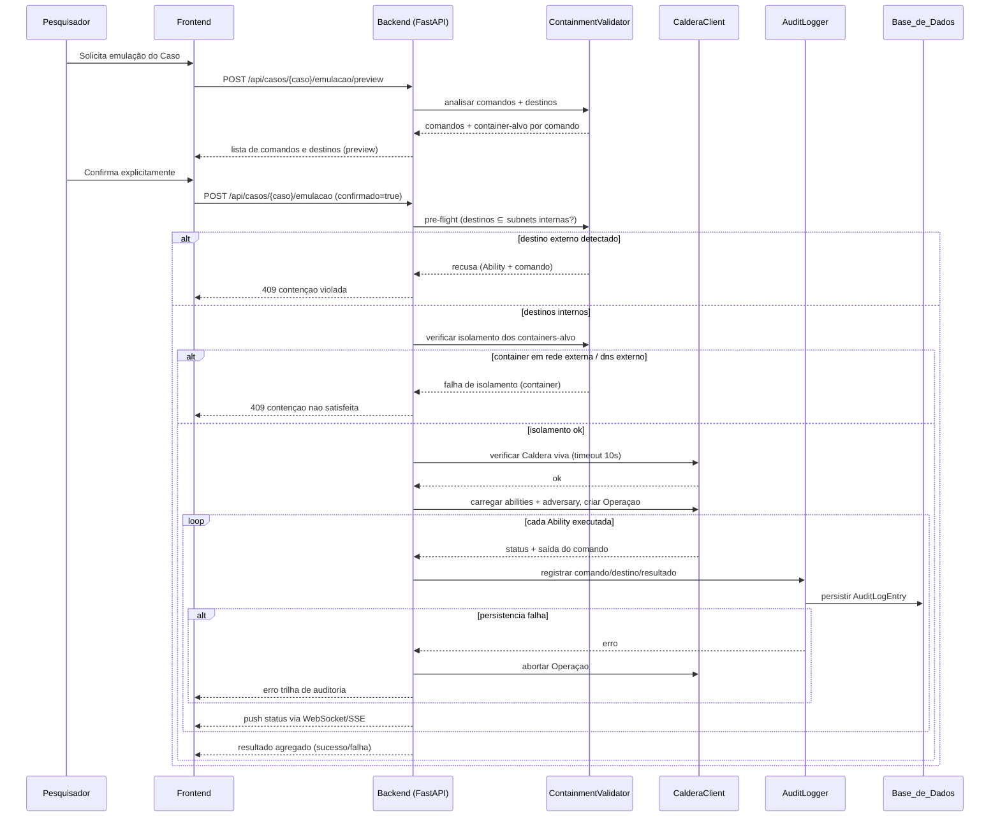

# Design Document

## Overview

### Objetivo

A **Pipeline_UI** é uma aplicação web (frontend + backend + banco de dados) que torna visível e conduzível o pipeline de três estágios do projeto **sticks**. O propósito científico do projeto é medir se a inteligência de ameaças em ATT&CK-in-STIX carrega informação procedural suficiente para reproduzir campanhas de APT num laboratório controlado. Esta primeira entrega entrega uma interface que (a) evidencia os três estágios com Entrada/Processamento/Saída explícitos, (b) conduz o Pesquisador passo a passo pelos 8 casos curados, (c) executa de forma **contida** pelo menos 1–2 casos dentro do Docker Desktop, (d) oferece tema claro/escuro com paleta blue/red/purple team, (e) internacionaliza pt-BR/en, e (f) persiste o estado para continuidade entre máquinas.

O backend reutiliza diretamente o pipeline Python existente (`sticks/lib/`, `sticks/tools/`, `sticks/config/config.py`) em vez de reescrevê-lo. Ele orquestra os estágios, fala com a Caldera pela API REST em `http://localhost:8888` e persiste tudo no banco.

### Resumo da arquitetura

- **Frontend**: SPA em React + TypeScript, servida localmente, comunicando-se com o backend por REST e recebendo atualizações em tempo real por WebSocket/SSE.
- **Backend**: serviço FastAPI (Python) que embute o código do pipeline existente, expõe a API da UI, aplica as verificações de contenção e persiste o estado.
- **Base_de_Dados**: PostgreSQL (produção/portabilidade) com opção de SQLite para desenvolvimento local, acessada via SQLAlchemy + Alembic.
- **Caldera + Ambiente_Docker**: plataforma de emulação e containers de laboratório (caldera, kali, nginx, db) em redes internas. O backend fala com a Caldera **somente pela API em `localhost:8888`** e **nunca** se conecta às redes internas de ataque.

### Princípios de design

1. **Segurança em primeiro lugar (contenção antes de tudo)**: nenhuma Operação inicia sem passar por verificações de isolamento e por confirmação explícita. A contenção é a maior preocupação do projeto e recebe tratamento de primeira classe (ver `ContainmentValidator` e a seção de Correctness Properties).
2. **Contenção verificável**: o estado real das redes e dos containers é inspecionado antes de cada emulação; comandos com destino fora das subnets internas bloqueiam a Operação inteira.
3. **Spec-driven e fiel ao código real**: o design mapeia diretamente os arquivos e ferramentas existentes (`data/api/*.json`, `data/dag/*.json`, `lib/operation.py`, `tools/`), sem inventar contratos.
4. **Extensibilidade da origem de tradução**: a origem da tradução do Estágio 2 é um atributo explícito e extensível ("curadoria humana" hoje; agentes de IA no futuro), sem alterar o modelo de Ability/Adversary.
5. **Portabilidade de estado**: todo o progresso vive no banco, permitindo retomar o trabalho em outra máquina.

### Decisão de design destacada — o vazamento de contenção atual

A inspeção do `docker/docker-compose.yml` revelou um risco concreto que o design **deve** endereçar: embora existam três redes marcadas `internal: true` (192.168.10.0/24, 192.168.20.0/24, 192.168.30.0/24), **todos** os containers (caldera, kali, nginx, db) também estão conectados a uma `local-network` do tipo `bridge` (com rota externa quando há portas expostas) e vários declaram `dns: 8.8.8.8`. Os comandos curados incluem egress real para a internet (por exemplo `wget https://nmap.org/dist/nmap-7.98.tgz`, `apt-get install`, `pip install`, `git clone`). Portanto, no estado atual, o ambiente **não** satisfaz o Requisito 6. O design trata isso como decisão explícita: define as verificações de contenção (pre-flight), a análise de destino dos comandos e a **configuração-alvo endurecida** recomendada. O objetivo desta entrega não é reescrever o compose, mas garantir que a Pipeline_UI **se recuse a executar** enquanto a contenção não estiver satisfeita.

## Architecture

### Visão de componentes e fluxo



Observações do diagrama:

- O **Frontend** e o **Backend** ficam na camada de aplicação e **não** participam das redes internas de ataque. A única via do backend para a emulação é a **API da Caldera em `localhost:8888`**.
- O backend inspeciona o estado dos containers e das redes pela **Docker Engine API** (socket local) apenas para leitura, a fim de validar isolamento — ele não injeta tráfego nas redes internas.
- A cadeia de ataque é hierárquica: caldera → kali → nginx (alvo A) → db (alvo B).

### Fluxo de uma emulação com pre-flight de contenção



### Escolha de stack e justificativas

O Requisito 10 exige tecnologias em suporte oficial, com release nos últimos 24 meses e documentação pública, operando integralmente sob Docker Desktop sem acesso à internet para conduzir os casos, e integração com o pipeline Python e `tools/`.

**Backend — FastAPI (Python 3.11+)**
- Justificativa: o pipeline existente já é Python (`lib/`, `tools/`, `config/config.py`). Com FastAPI o backend **importa e reutiliza** esse código diretamente, sem porta para outra linguagem nem duplicação de lógica. FastAPI oferece tipagem com Pydantic (ótima para desenvolvimento assistido por IA), documentação OpenAPI automática, suporte nativo a async e a WebSocket/SSE para progresso em tempo real.
- Alternativas consideradas: Flask (menos recursos async e de validação); Django (peso desnecessário para uma API orientada a serviços). Node/TypeScript no backend foi descartado por exigir reescrever/rehospedar o pipeline Python.

**Frontend — React + TypeScript + Vite + Tailwind CSS + shadcn/ui + i18next**
- Justificativa: React + TypeScript é um ecossistema maduro e amplamente coberto por assistentes de IA. Vite dá build e dev-server rápidos. Tailwind + shadcn/ui facilitam temas claro/escuro (via classe `dark` e tokens de cor CSS) e trazem componentes acessíveis por padrão. i18next cobre pt-BR/en com fallback configurável.
- Alternativas consideradas: Vue/Svelte (bons, porém React tem maior cobertura de exemplos para dev com IA); MUI (mais opinativo que shadcn/ui para a paleta blue/red/purple team).

**Base_de_Dados — PostgreSQL (com SQLite para dev local) via SQLAlchemy + Alembic**
- Justificativa: PostgreSQL é robusto, portável e roda como serviço no compose, atendendo à continuidade entre máquinas (o estado vive no banco). SQLAlchemy + Alembic dão modelos versionados e migrações reprodutíveis. Para desenvolvimento local mínimo, SQLite (arquivo único) reduz atrito; o mesmo mapeamento SQLAlchemy atende aos dois.
- Alternativas consideradas: MongoDB (o domínio é relacional — casos, estágios, operações, resultados, auditoria); persistência só em arquivos (dificulta consultas e continuidade).

**Tempo real — WebSocket (canal primário) com SSE como alternativa**
- Justificativa: o progresso de estágios (Req. 1.5) e o status por Ability durante a Operação (Req. 4.3/4.4) exigem push. WebSocket é bidirecional e bem suportado por FastAPI; SSE é aceitável como fallback unidirecional.

**Empacotamento — Docker Desktop**
- Frontend, backend e banco entram como novos serviços no `docker-compose.yml`, na camada de aplicação, **sem** participar das redes internas de ataque. Isso satisfaz o Req. 10.3 (operar integralmente sob Docker Desktop) sem exigir internet para conduzir os casos.

## Components and Interfaces

### Componentes do Frontend

- **Visão de Pipeline (PipelineOverview)**: apresenta os três Estágios simultaneamente, cada um com seções rotuladas de Entrada, Processamento e Saída e um indicador de estado ("não iniciado", "em andamento", "concluído", "erro"). Mostra o progresso agregado dos 8 casos (Req. 1, 5.5).
- **Telas de Estágio (Stage1View / Stage2View / Stage3View)**: cada uma com três painéis visualmente separados — Entrada, Processamento, Saída — específicos do estágio.
  - *Stage1View*: Entrada = dataset STIX de origem; Saída = técnicas ATT&CK, relacionamentos, e quando presentes indicadores/infraestrutura/malware/metadados (Req. 2).
  - *Stage2View*: Entrada = técnicas abstratas do Estágio 1; Saída = Abilities curadas (técnica, tática, descrição, comando por executor), ordem/dependências, agrupamento em Adversary, e o **indicador de origem da tradução** ("curadoria humana") como atributo explícito e extensível (Req. 3, 11).
  - *Stage3View*: Entrada = Adversary + Abilities; Processamento = status por Ability em tempo real; Saída = resultado por Ability e agregado (Req. 4).
- **Seletor de Caso (CaseSelector)**: lista os 8 casos curados, conduz na ordem Estágio 1 → 2 → 3, sinaliza estágios bloqueados e impede iniciá-los (Req. 5).
- **Painel de Tema/Idioma (PreferencesPanel)**: alterna Modo_Claro/Modo_Escuro (paleta blue/red/purple team) e Idioma pt-BR/en sem recarregar a página; persiste as preferências no Estado_de_Sessão (Req. 7, 8).
- **Modal de Confirmação de Emulação (EmulationConfirmModal)**: exibe, **antes de qualquer confirmação**, a lista completa dos comandos concretos e o container de destino de cada um, e requer confirmação explícita. Cancelar retorna ao estado anterior sem executar nada (Req. 6.5–6.7).

### Serviços do Backend

- **CaseService**: lê e valida os pares `data/api/{caso}_dag-ability.json` e `{caso}_dag-adversary.json` e o grafo `data/dag/{caso}_dag.json`. Expõe metadados dos casos, Abilities, Adversary e ordenação. Trata ausência/erro de leitura de arquivos por caso, mantendo os demais disponíveis (Req. 5.6).
- **StageService**: orquestra cada estágio. Estágio 1 invoca a modelagem estrutural do pipeline existente (`lib/stix.py`, `lib/ability.py`) e persiste os elementos extraídos. Estágio 2 monta a Entrada/Saída a partir dos arquivos curados. Estágio 3 delega à emulação. Emite eventos de progresso e transições de estado.
- **CalderaClient**: encapsula a API da Caldera reutilizando a configuração de `config.py` (`CALDERA_URL`, header `KEY: ADMIN123`). Verifica disponibilidade (timeout 10s), carrega abilities (`POST /api/v2/abilities`), lista/gerencia adversaries (`GET /api/v2/adversaries`) e cria/consulta Operações (compatível com `lib/operation.py`, planner "atomic", group "red", jitter). Faz polling do estado da Operação e dos links para status por Ability.
- **ContainmentValidator**: núcleo de segurança. (a) **Parser de comandos**: extrai endereços de destino dos comandos (IPs, URLs, hosts em `ssh`, `curl`, `wget`, `sshpass ... user@host`, etc.). (b) **Validação de subnets**: confirma que todo destino pertence às subnets internas 192.168.10.0/24, 192.168.20.0/24 ou 192.168.30.0/24; qualquer destino externo (por exemplo `https://nmap.org`) recusa a Ability e impede a Operação. (c) **Verificação de isolamento**: inspeciona, via Docker Engine API (leitura), cada container-alvo para confirmar que está conectado somente a redes `internal: true`, sem `local-network` e sem `dns` externo; caso contrário, aborta. (d) **Preview**: produz a lista de comandos e destinos para o modal de confirmação.
- **OperationRunner**: conduz a Operação após aprovação da contenção e confirmação do Pesquisador. Aciona o `CalderaClient`, acompanha o progresso, agrega sucessos/falhas e coordena a auditoria a cada comando.
- **AuditLogger**: registra, para cada comando executado, o comando, o container de destino e o resultado, persistindo um `AuditLogEntry` na Base_de_Dados. Se a persistência falhar durante a Operação, sinaliza o `OperationRunner` para abortar (Req. 6.8–6.9).
- **SessionStateService**: lê e grava o Estado_de_Sessão (caso atual, estágios concluídos por caso, resultados de operações, preferências de tema/idioma), garantindo continuidade entre máquinas (Req. 9).

### Configuração-alvo endurecida (contenção)

O `ContainmentValidator` valida contra a seguinte configuração-alvo recomendada, e recusa emulações enquanto ela não estiver satisfeita:

- Remover `local-network` dos containers de ataque e de alvo (kali, nginx, db) — e idealmente de caldera —, deixando-os apenas nas redes `internal: true`.
- Remover as diretivas `dns: 8.8.8.8` desses containers.
- Alternativamente, definir uma única rede `internal: true` dedicada de laboratório sem nenhuma bridge externa.
- Comandos curados que dependem de egress (`apt-get install`, `pip install`, `git clone`, `wget`/`curl` externos) devem ser pré-satisfeitos por imagens/hosts preparados offline, já que a Operação será bloqueada se apontarem para fora das subnets internas.

Esta é uma recomendação de endurecimento; o design não reescreve o compose nesta entrega, mas especifica as verificações e a meta.

#### Decisão registrada (revisada) — endurecimento no compose real, seguro por padrão

Decisão (revisada, substitui a Opção A anterior): o endurecimento da contenção é aplicado **diretamente no `docker/docker-compose.yml` real do projeto**, tornando o ambiente **seguro por padrão** para todos os integrantes, em vez de um arquivo de compose separado. Motivação: a Pipeline_UI será integrada à `main` e distribuída como ferramenta; um compose paralelo geraria divergência entre o que cada pessoa executa e a pergunta "qual arquivo eu uso?". Um único compose endurecido é mais simples de manter e de explicar no Pull Request.

O `docker/docker-compose.yml` endurecido deve:

- Remover a `local-network` (bridge) de `kali`, `nginx` e `db` (atacante e alvos), deixando-os **exclusivamente** nas redes `internal: true` (192.168.10.0/24, 192.168.20.0/24, 192.168.30.0/24). A `caldera` mantém acesso de gestão apenas o necessário para expor a API em `localhost:8888`.
- Remover as diretivas `dns` externas (`8.8.8.8`) desses containers.
- Remover as portas expostas dos alvos (`db` 33006, `nginx` 8000/8443); manter exposta **apenas** `caldera:8888`, usada pelo Pesquisador (UI da Caldera) e pelo Backend (API da Caldera).
- Remover `privileged: true` do `kali` e reduzir as capabilities ao mínimo necessário para a emulação contida.

Build vs. runtime: `internal: true` afeta apenas o runtime, não o `docker build`. Os Dockerfiles (Kali baixa nmap/metasploit; Caldera baixa Go/Node/atomic) continuam podendo baixar dependências durante o build pela rede default do Docker; o endurecimento só remove o egress em tempo de execução.

Casos curados adaptados para contenção total: os comandos curados que apontavam para destinos externos foram adaptados **in-place** nos arquivos dos casos (`sticks/data/api/*_dag-ability.json`) para alvos internos do laboratório, preservando a técnica ATT&CK. O antes/depois de cada comando adaptado está documentado em `docker/CONTAINMENT_CHANGES.md` para rastreabilidade e para o Pull Request. Assim os 8 casos rodam de ponta a ponta de forma contida, e o `ContainmentValidator` continua sendo a rede de segurança que recusa qualquer destino externo que venha a ser reintroduzido.

Aplicação: o objetivo é permitir que **qualquer usuário rode o fluxo completo com segurança em sua própria máquina** (inclusive um notebook de trabalho), não apenas numa máquina de laboratório dedicada. A execução real ocorre sob Docker Desktop com o compose endurecido; nenhum comando de adversário alcança o host nem a internet.

### Endpoints REST (contratos em pt-BR)

- `GET /api/casos` — lista os 8 casos curados com estado por estágio e progresso agregado. Erros de leitura de um caso são reportados por caso sem derrubar os demais.
- `GET /api/casos/{caso}` — detalha um caso (Abilities, Adversary, ordenação, origem de tradução).
- `GET /api/casos/{caso}/estagio/1` — Entrada/Processamento/Saída do Estágio 1.
- `POST /api/casos/{caso}/estagio/1/executar` — dispara a modelagem estrutural; emite progresso.
- `GET /api/casos/{caso}/estagio/2` — Entrada (técnicas abstratas), Saída (Abilities curadas, ordem, Adversary), origem de tradução.
- `GET /api/casos/{caso}/estagio/3` — Entrada (Adversary + Abilities) e Saída acumulada.
- `POST /api/casos/{caso}/emulacao/preview` — retorna a lista completa de comandos e o container de destino de cada um (sem executar).
- `POST /api/casos/{caso}/emulacao` — inicia a emulação apenas com `confirmado=true`; executa pre-flight de contenção; retorna 409 em violação (identificando Ability/comando ou container) e 503 se a Caldera não responder em 10s.
- `GET /api/casos/{caso}/operacao` — resultado por Ability e agregado.
- `GET /api/estado-sessao` — recupera o Estado_de_Sessão persistido.
- `PUT /api/preferencias` — atualiza tema e idioma.
- `GET /api/auditoria/{operacao}` — trilha de auditoria persistida da Operação.

### Canais WebSocket/SSE

- `WS /ws/estagios/{caso}` — transições de estado dos estágios e percentual de progresso (atualizado ao menos a cada 5s enquanto "em andamento").
- `WS /ws/operacao/{operacao}` — status por Ability ("pendente", "em execução", "sucesso", "falha"), saída do comando e resultado agregado ao final.

## Data Models

Modelos SQLAlchemy (nomes de tabela em português). Os campos mapeiam diretamente o formato dos arquivos JSON existentes em `data/api/` e `data/dag/`.

### Enum extensível de origem da tradução

```python
import enum

class TranslationSource(str, enum.Enum):
    HUMAN_CURATION = "curadoria_humana"   # valor das 8 traduções existentes
    # Valores futuros (fora de escopo de implementação) podem ser adicionados
    # sem alterar o modelo de Ability/Adversary, por exemplo:
    # AI_AGENT = "agente_ia"
```

### Case (caso curado)

```python
class Case(Base):
    __tablename__ = "casos"
    id = Column(String, primary_key=True)          # slug: "shadowray", "apt41_dust", ...
    nome = Column(String, nullable=False)          # "ShadowRay"
    descricao = Column(Text)
    arquivo_ability = Column(String)               # caminho data/api/{caso}_dag-ability.json
    arquivo_adversary = Column(String)             # caminho data/api/{caso}_dag-adversary.json
    arquivo_dag = Column(String)                   # caminho data/dag/{caso}_dag.json
    origem_traducao = Column(Enum(TranslationSource),
                             default=TranslationSource.HUMAN_CURATION)
```

### Stage e StageRun (estágio e sua execução)

```python
class StageState(str, enum.Enum):
    NOT_STARTED = "nao_iniciado"
    IN_PROGRESS = "em_andamento"
    COMPLETED = "concluido"
    ERROR = "erro"

class StageRun(Base):
    __tablename__ = "execucoes_estagio"
    id = Column(Integer, primary_key=True)
    caso_id = Column(String, ForeignKey("casos.id"))
    estagio = Column(Integer, nullable=False)      # 1, 2 ou 3
    estado = Column(Enum(StageState), default=StageState.NOT_STARTED)
    progresso = Column(Integer, default=0)         # 0..100
    mensagem_erro = Column(Text)                   # causa da falha, quando estado == erro
    etapa_falha = Column(String)                   # etapa da modelagem em que falhou (Estágio 1)
    atualizado_em = Column(DateTime)
```

### Ability (mapeia `{caso}_dag-ability.json`)

```python
class Ability(Base):
    __tablename__ = "abilities"
    ability_id = Column(String, primary_key=True)  # uuid do arquivo
    caso_id = Column(String, ForeignKey("casos.id"))
    name = Column(String)                           # "T1102 - Web Service"
    tactic = Column(String)
    technique_name = Column(String)
    technique_id = Column(String)
    description = Column(Text)
    executors = Column(JSON)                        # lista de {name, platform, command}
    origem_traducao = Column(Enum(TranslationSource),
                             default=TranslationSource.HUMAN_CURATION)
```

### Adversary (mapeia `{caso}_dag-adversary.json`)

```python
class Adversary(Base):
    __tablename__ = "adversaries"
    id = Column(String, primary_key=True)           # id do arquivo
    caso_id = Column(String, ForeignKey("casos.id"))
    name = Column(String)
    description = Column(Text)
    atomic_ordering = Column(JSON)                  # lista ordenada de ability_ids
    origem_traducao = Column(Enum(TranslationSource),
                             default=TranslationSource.HUMAN_CURATION)
```

### Operation e AbilityResult (execução na Caldera)

```python
class OperationState(str, enum.Enum):
    NOT_STARTED = "nao_iniciada"
    RUNNING = "em_execucao"
    FINISHED = "finalizada"
    ABORTED = "abortada"

class Operation(Base):
    __tablename__ = "operacoes"
    id = Column(Integer, primary_key=True)
    caso_id = Column(String, ForeignKey("casos.id"))
    caldera_operation_id = Column(String)
    estado = Column(Enum(OperationState), default=OperationState.NOT_STARTED)
    total_sucesso = Column(Integer, default=0)      # agregado (Req. 4.5)
    total_falha = Column(Integer, default=0)
    iniciada_em = Column(DateTime)
    finalizada_em = Column(DateTime)

class AbilityResultStatus(str, enum.Enum):
    PENDING = "pendente"
    RUNNING = "em_execucao"
    SUCCESS = "sucesso"
    FAILURE = "falha"

class AbilityResult(Base):
    __tablename__ = "resultados_ability"
    id = Column(Integer, primary_key=True)
    operacao_id = Column(Integer, ForeignKey("operacoes.id"))
    ability_id = Column(String, ForeignKey("abilities.ability_id"))
    status = Column(Enum(AbilityResultStatus), default=AbilityResultStatus.PENDING)
    saida_comando = Column(Text)                    # stdout/stderr do comando
```

### AuditLogEntry (trilha de auditoria persistida — Req. 6.8)

```python
class AuditLogEntry(Base):
    __tablename__ = "auditoria"
    id = Column(Integer, primary_key=True)
    operacao_id = Column(Integer, ForeignKey("operacoes.id"))
    ability_id = Column(String)
    comando = Column(Text, nullable=False)          # comando concreto executado
    container_destino = Column(String, nullable=False)  # ex "nginx (192.168.20.30)"
    resultado = Column(Text)                        # sucesso/falha + saída
    registrado_em = Column(DateTime, nullable=False)
```

### SessionState e UserPreferences (continuidade e preferências)

```python
class Theme(str, enum.Enum):
    LIGHT = "claro"
    DARK = "escuro"

class Language(str, enum.Enum):
    PT_BR = "pt-BR"
    EN = "en"

class SessionState(Base):
    __tablename__ = "estado_sessao"
    id = Column(Integer, primary_key=True)
    caso_atual = Column(String, ForeignKey("casos.id"), nullable=True)
    # estágios concluídos por caso e resultados são derivados de StageRun/Operation,
    # associados ao caso correspondente (Req. 9.1, 9.7)
    atualizado_em = Column(DateTime)

class UserPreferences(Base):
    __tablename__ = "preferencias"
    id = Column(Integer, primary_key=True)
    tema = Column(Enum(Theme), default=Theme.LIGHT)      # padrão Modo_Claro (Req. 7.6)
    idioma = Column(Enum(Language), default=Language.PT_BR)  # padrão pt-BR (Req. 8.6)
```

### Mapeamento arquivo → modelo

| Arquivo | Modelo | Campos-chave |
| --- | --- | --- |
| `data/api/{caso}_dag-ability.json` (lista) | `Ability` | `ability_id`, `name`, `tactic`, `technique_id`, `description`, `executors[].command` |
| `data/api/{caso}_dag-adversary.json` (objeto) | `Adversary` | `id`, `name`, `description`, `atomic_ordering[]` |
| `data/dag/{caso}_dag.json` | Entrada do Estágio 1/2 (grafo) | `campaign_name`, `structural_nodes[]`, `parent_nodes`, `child_nodes`, `ai_prompt_template` |

O campo `ai_prompt_template` do DAG é o prompt que futuros agentes de IA usarão (fora de escopo). A UI o acomoda como conteúdo somente-leitura ligado à origem de tradução extensível, sem alterar `Ability`/`Adversary`.

## Correctness Properties

*Uma propriedade é uma característica ou comportamento que deve ser verdadeiro em todas as execuções válidas do sistema — essencialmente uma afirmação formal sobre o que o sistema deve fazer. As propriedades servem de ponte entre especificações legíveis por humanos e garantias de correção verificáveis por máquina.*

As propriedades abaixo priorizam **contenção e segurança**, a maior preocupação do projeto. Cada uma é universalmente quantificada e destinada a testes baseados em propriedades (Hypothesis, no backend Python).

### Property 1: Nenhuma emulação inicia com destino externo

*Para qualquer* Adversary com qualquer conjunto de Abilities e comandos, se pelo menos um comando tem endereço de destino que não pertence às subnets internas (192.168.10.0/24, 192.168.20.0/24, 192.168.30.0/24), então o Backend recusa a Ability e não inicia a Operação, identificando a Ability e o comando com destino externo.

**Validates: Requirements 6.1, 6.2**

### Property 2: Emulação só prossegue com todos os containers-alvo isolados

*Para qualquer* conjunto de containers-alvo com configurações de rede arbitrárias, o pre-flight aprova a Operação se e somente se todos os containers-alvo estão conectados exclusivamente a redes internas (sem rede bridge externa e sem DNS externo); se algum não estiver isolado, a Operação aborta sem executar nenhum comando, identificando o container que falhou.

**Validates: Requirements 6.3, 6.4**

### Property 3: A UI nunca permite iniciar um estágio bloqueado

*Para qualquer* caso e qualquer combinação de estados dos três estágios, um estágio n só é iniciável se n == 1 ou se o estágio n-1 está no estado "concluído"; caso contrário ele é sinalizado como bloqueado e não pode ser iniciado.

**Validates: Requirements 5.4**

### Property 4: O progresso agregado conta exatamente os casos totalmente concluídos

*Para qualquer* distribuição de estados dos estágios entre os 8 casos, o progresso agregado de replicação é igual à quantidade de casos cujos três estágios estão no estado "concluído".

**Validates: Requirements 5.5**

### Property 5: Toda execução gera exatamente um registro de auditoria

*Para qualquer* Operação em que K comandos são executados, a trilha de auditoria persistida contém exatamente K registros, cada um com o comando, o container de destino e o resultado correspondentes.

**Validates: Requirements 6.8**

### Property 6: Execução exige confirmação explícita

*Para qualquer* solicitação de emulação, o Backend inicia a Operação se e somente se a confirmação explícita do Pesquisador é fornecida (confirmado verdadeiro); na ausência de confirmação ou em cancelamento, nenhum comando de adversário é executado e o estado retorna ao anterior à solicitação.

**Validates: Requirements 6.6, 6.7**

### Property 7: Falha de auditoria aborta a Operação

*Para qualquer* Operação em que a persistência de um registro de auditoria falha em algum passo, o Backend aborta a Operação a partir desse ponto e nenhum comando adicional é executado.

**Validates: Requirements 6.9**

### Property 8: Round-trip do Estado_de_Sessão

*Para qualquer* Estado_de_Sessão válido (caso atual, estágios concluídos por caso e resultados de operações por Ability), persistir e em seguida recuperar produz um estado estruturalmente igual ao persistido.

**Validates: Requirements 9.1, 9.4**

### Property 9: Falha de persistência preserva o estado anterior

*Para qualquer* Estado_de_Sessão previamente persistido, se a persistência da conclusão de um estágio falha, então o estado persistido permanece idêntico ao anterior à tentativa, sem alteração parcial.

**Validates: Requirements 9.3**

### Property 10: Agregação da Operação é consistente com os resultados por Ability

*Para qualquer* conjunto de resultados por Ability de uma Operação, o resultado agregado reporta exatamente a quantidade de Abilities com status "sucesso" e a quantidade com status "falha".

**Validates: Requirements 4.5**

### Property 11: Fallback de i18n sempre resolve para pt-BR

*Para qualquer* chave de tradução e qualquer idioma selecionado, se a chave não possui valor no idioma selecionado, o texto exibido é o valor correspondente em pt-BR.

**Validates: Requirements 8.3**

### Property 12: Normalização de idioma inválido para pt-BR

*Para qualquer* valor de preferência de idioma persistido, o idioma efetivo é esse valor quando ele é pt-BR ou en, e é pt-BR em qualquer outro caso.

**Validates: Requirements 8.7**

## Error Handling

O tratamento de erros preserva o Estado_de_Sessão dos demais elementos e sempre comunica a causa ao Pesquisador.

- **Caldera indisponível (timeout 10s)**: o `CalderaClient` verifica a disponibilidade antes de iniciar. Se a Caldera não responder em `localhost:8888` dentro de 10 segundos, o Backend **não** inicia nenhuma Operação e a UI exibe que o Ambiente_Docker está indisponível (Req. 4.6). Retorno HTTP 503.
- **Falha de modelagem no Estágio 1**: se a modelagem estrutural falha, o `StageService` registra a falha **sem persistir extração parcial**, marca o estágio como "erro" e informa o caso afetado e a etapa da modelagem em que ocorreu (Req. 2.6). Extração vazia (sem técnicas) é tratada como sucesso com Saída indicando ausência de elementos (Req. 2.5).
- **Arquivos de caso ausentes ou ilegíveis**: o `CaseService` reporta o erro por caso (arquivo ausente ou JSON malformado), registra a falha e mantém os demais casos disponíveis para seleção (Req. 5.6).
- **Falha na verificação de contenção**: destino externo em algum comando (Req. 6.2) ou container-alvo não isolado (Req. 6.4) resulta em recusa/abort antes de qualquer execução, com mensagem identificando a Ability/comando ou o container. Retorno HTTP 409.
- **Falha de auditoria durante a Operação**: se a persistência de um `AuditLogEntry` falha, o `OperationRunner` aborta a Operação e a UI informa que a trilha de auditoria não pôde ser registrada (Req. 6.9).
- **Falha de persistência de estado**: se a persistência da conclusão de um estágio falha, o Backend preserva o Estado_de_Sessão anterior sem alteração e a UI informa que a conclusão não foi salva (Req. 9.3). Se o Estado_de_Sessão persistido não puder ser lido na abertura, a UI informa que o progresso não pôde ser restaurado, sem descartar o estado persistido (Req. 9.6).
- **Dependência externa ao Docker Desktop**: se conduzir um caso exigir um serviço acessível apenas fora da instalação local, o Backend interrompe a condução desse caso e a UI indica qual dependência externa impediu a operação, preservando o estado já registrado (Req. 10.5).

## Testing Strategy

A abordagem combina testes unitários, de integração, baseados em propriedades e específicos de contenção, além de testes de UI. Testes unitários cobrem exemplos concretos e casos de borda; testes de propriedades cobrem correção universal sobre muitas entradas.

### Testes baseados em propriedades (backend Python)

- Biblioteca: **Hypothesis** (não implementar PBT do zero).
- Cada propriedade da seção Correctness Properties é implementada por **um único** teste baseado em propriedades, com **mínimo de 100 iterações**.
- Cada teste é anotado com um comentário referenciando a propriedade, no formato:
  **Feature: pipeline-ui, Property {número}: {texto da propriedade}**.
- Geradores relevantes: comandos com destinos internos e externos misturados (para as propriedades de contenção), configurações de rede de containers (isoladas e não isoladas), distribuições de estados de estágio para os 8 casos, chaves de tradução e idiomas (válidos e inválidos), e Estados_de_Sessão arbitrários para round-trip.
- Foco especial de contenção: a Property 1 e a Property 2 devem ser exercitadas com comandos reais do estilo dos casos curados (por exemplo `wget https://nmap.org/...`, `apt-get install`, `sshpass ... attacker@192.168.20.30`), garantindo que destinos externos são bloqueados e destinos internos passam.

### Testes de contenção (segurança)

- Testes dedicados garantem que **qualquer** comando com destino fora de 172.20/21/22.0.0/24 bloqueia a Operação inteira e identifica a Ability/comando.
- Testes garantem que um container conectado à `local-network` (bridge) ou com `dns` externo é classificado como **não isolado** e aborta o pre-flight.
- Testes negativos confirmam que nenhuma execução ocorre quando a confirmação explícita está ausente.

### Testes de integração

- **Caldera mockada**: verifica o contrato do `CalderaClient` (carregar abilities via `POST /api/v2/abilities`, listar adversaries via `GET /api/v2/adversaries`, criar/consultar Operações compatível com `lib/operation.py`) sem depender do serviço real.
- **Caldera real em Docker**: executa de ponta a ponta 1–2 casos curados dentro do Docker Desktop, validando a emulação com contenção satisfeita.
- **Estágio 1 real**: executa a modelagem estrutural do pipeline existente para 1–2 casos e verifica extração não-vazia (integração; não é propriedade).
- **Timeout da Caldera**: simula a Caldera não responsiva para confirmar o comportamento de 10s (exemplo/integração, Req. 4.6).

### Testes de UI (frontend)

- **Componentes/snapshot**: seções rotuladas de Entrada/Processamento/Saída por estágio, seletor de caso com estágios bloqueados, modal de confirmação exibindo comandos e destinos.
- **Temas**: troca entre Modo_Claro e Modo_Escuro sem recarregar a página e aplicação da paleta blue/red/purple team aos contextos defensivo/ofensivo/combinado.
- **i18n**: troca de idioma sem reload, exibição de pt-BR/en e verificação de fallback para pt-BR quando falta tradução.

### Balanceamento

Os testes unitários concentram-se em exemplos e bordas (arquivo de caso ausente/ilegível, extração vazia no Estágio 1, timeout da Caldera). Os testes de propriedades cobrem a correção universal, especialmente da contenção. Evita-se excesso de testes unitários onde a propriedade já cobre a variação de entradas.
