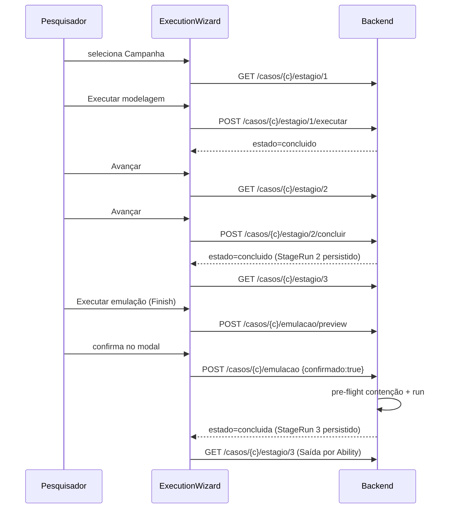

# Design Document — Wizard de Execução Guiada

## Overview

A feature adiciona um fluxo linear estilo assistente sobre a UI já existente do STICKS Pipeline UI e fecha duas lacunas no backend. O princípio norteador é **reaproveitamento**: as telas `Stage1View`/`Stage2View`/`Stage3View` e o `EmulationConfirmModal` já renderizam Entrada/Processamento/Saída e a confirmação de emulação corretamente; o Wizard apenas os orquestra em sequência e materializa as transições de estado que hoje não existem.

Duas pontas de backend faltam hoje:

1. **Conclusão do Estágio 2** — não há endpoint REST que exponha `persist_stage_completion` para os estágios 2 e 3. Como a tradução do Estágio 2 é curada (os artefatos já existem), "avançar do 2" é, semanticamente, "concluir o 2". Adicionamos `POST /api/casos/{caso}/estagio/2/concluir`.
2. **Conclusão do Estágio 3 pós-emulação** — o endpoint `POST /api/casos/{caso}/emulacao` executa a emulação, mas não marca o Estágio 3 como `concluido`. Adicionamos essa persistência quando o resultado for `COMPLETED`.

Além disso, um endpoint de **reset** por campanha (`POST /api/casos/{caso}/reset`) permite reexecutar a demo do zero.

O SQLite (`pipeline_ui.db`) permanece a fonte da verdade. Todas as transições passam por `SessionStateService.persist_stage_completion`, que já garante atomicidade e preservação de estado em falha. O bloqueio sequencial (Estágio N só inicia se N-1 concluído) continua derivado do estado persistido — o Wizard nunca mantém estado de progresso próprio.

### Pesquisa / decisões de contexto

- **`persist_stage_completion` como única via de conclusão** — confirmado em `app/services/session/session_state_service.py`: faz upsert do `StageRun(caso,estagio)` para `concluido` e atualiza `estado_sessao.atualizado_em` numa única transação, com rollback preservando o estado anterior (Req. 3.6, 4). Reusar esse método evita divergência entre tabelas.
- **`StageService.get_stage_states` / `aggregate_progress`** — já usados por `GET /api/casos` para derivar o estado por estágio e o progresso; o Wizard consome esse mesmo contrato (Req. 5), sem nova fonte de verdade.
- **`OperationRunner.run` retorna `RunOutcome`** — confirmado em `app/api/emulacao.py`: o handler mapeia `COMPLETED/ABORTED` para 200. A conclusão do Estágio 3 só deve ocorrer em `COMPLETED` (`estado == OperationState.concluida`), nunca em `ABORTED`/`NOT_CONFIRMED`/409/503 (Req. 4.4, 4.5).
- **Pre-flight de contenção inegociável** — permanece integralmente dentro de `OperationRunner.run`; o Wizard não o replica nem o contorna, apenas aciona o endpoint existente (restrição do laboratório).

## Architecture

```mermaid
flowchart LR
  subgraph FE[Frontend React]
    Wiz[ExecutionWizard]
    S1[Stage1View]
    S2[Stage2View]
    S3[Stage3View]
    Modal[EmulationConfirmModal]
    Wiz --> S1 & S2 & S3
    Wiz --> Modal
  end
  subgraph BE[Backend FastAPI]
    EP1[POST estagio/1/executar]
    EP2[POST estagio/2/concluir  *novo*]
    EP3[POST emulacao  *persiste conclusao do 3*]
    EPR[POST reset  *novo*]
    GET[GET casos / estagio/N]
  end
  subgraph DB[(SQLite pipeline_ui.db)]
    SR[StageRun]
    OP[Operation/AbilityResult]
  end
  Wiz -->|lê estado| GET
  Wiz --> EP1 & EP2 & EPR
  Modal --> EP3
  EP1 & EP2 --> SSS[SessionStateService.persist_stage_completion]
  EP3 --> Runner[OperationRunner.run] --> SSS
  EPR --> Reset[reset de StageRun + Operation]
  SSS --> SR
  Reset --> SR & OP
```

Fluxo guiado (caminho feliz):



## Components and Interfaces

### Backend

**1. Novo endpoint — concluir Estágio 2** (`app/api/casos.py`)

```
POST /api/casos/{caso}/estagio/2/concluir  -> StageConclusionResponse
```
- Valida slug conhecido (404 se não).
- Lê `StageService.get_stage_states(caso)`; se o Estágio 1 não está `concluido`, retorna **409** sem persistir (Bloqueio_Sequencial, Req. 3.3).
- Caso contrário chama `SessionStateService(db).persist_stage_completion(caso, 2)`.
- Se `saved=False`, retorna **500** com a mensagem do serviço, estado anterior preservado (Req. 3.6).
- Resposta: estado por estágio atualizado (`CaseStageStates`) para o Wizard rerenderizar.

**2. Ajuste no endpoint de emulação** (`app/api/emulacao.py`)

No `executar_emulacao`, após obter `result` do runner, **antes de montar a resposta de sucesso**:
```
if result.outcome is RunOutcome.COMPLETED and result.state is OperationState.concluida:
    SessionStateService(db).persist_stage_completion(caso, 3)
```
Nenhum outro ramo persiste (ABORTED/NOT_CONFIRMED/409/503) (Req. 4.4, 4.5). A falha ao persistir a conclusão não deve derrubar a emulação já executada: é registrada, mas a resposta de sucesso é mantida (a conclusão pode ser reconciliada relendo o estado).

**3. Novo endpoint — reset de campanha** (`app/api/casos.py`)

```
POST /api/casos/{caso}/reset  -> CaseStageStates
```
- Valida slug conhecido (404 se não).
- Remove, em transação única, os `StageRun` da campanha e as `Operation`/`AbilityResult` associadas (`Operation.caso_id == caso`).
- Retorna o estado por estágio recém-derivado (Estágio 1 `nao_iniciado`, 2 e 3 `bloqueado`).

Os três endpoints são finos e delegam a serviços; nenhum contrato de resposta expõe detalhes do SQLite, de modo que a futura migração a PostgreSQL não altera a API (restrição de escopo futuro).

### Frontend

**`ExecutionWizard` (novo componente)** — orquestra o fluxo. Estado local mínimo: `estagioAtual` (1|2|3) e flags de carregamento/erro. **Não** mantém estado de progresso próprio: relê o Backend após cada transição e deriva os badges a partir da resposta.

- Reutiliza `Stage1View`/`Stage2View`/`Stage3View` para o corpo de cada passo (via `StageViewHost` ou renderização direta).
- Reutiliza `EmulationConfirmModal` para a confirmação do Estágio 3.
- Controles: "Voltar" (N>1), "Avançar para o próximo estágio" (habilitado só quando o próximo não está `bloqueado`), "Executar modelagem" (Estágio 1 não concluído) e "Executar emulação/Finish" (Estágio 3).
- Wrappers de API em `src/lib/estagios.ts` (estende sem editar os existentes): `concluirEstagio2(caso)`, `resetCaso(caso)`.

**`App.tsx`** — passa a montar o `ExecutionWizard` quando há campanha selecionada, mantendo o `EmulationConfirmModal` já existente no nível do App.

**Função pura de derivação** `derivarEstados(concluidos: number[]) : Record<1|2|3, EstadoEstagio>` — centraliza a regra do bloqueio sequencial no frontend para badges/controles e é o alvo das propriedades 1 e 2.

## Data Models

Nenhuma tabela nova. Reaproveita as entidades de `app/models/domain.py`:
- `StageRun(caso_id, estagio, estado, progresso, ...)` — fonte do estado por estágio.
- `Operation(caso_id, estado, total_sucesso, total_falha)` + `AbilityResult(operacao_id, ability_id, status, saida_comando)` — Saída do Estágio 3.
- `SessionState(caso_atual, atualizado_em)` — continuidade entre máquinas.

Contrato de resposta reutilizado: `CaseStageStates` (de `StageService`). Request body dos novos POSTs de conclusão/reset: vazio.

## Correctness Properties

*Uma propriedade é uma característica ou comportamento que deve valer para todas as execuções válidas do sistema — uma afirmação formal sobre o que o sistema deve fazer. Propriedades servem de ponte entre a especificação legível por humanos e garantias de correção verificáveis por máquina.*

### Property 1: Derivação do bloqueio sequencial

*Para qualquer* subconjunto de estágios concluídos de uma campanha, a função de derivação de estado marca o Estágio N (N em {2,3}) como `bloqueado` se e somente se o Estágio N-1 não está concluído; e habilita "Avançar" para o Estágio N+1 somente quando o Estágio N+1 não está `bloqueado`. Logo, o Wizard nunca permite avançar para um estágio bloqueado.

**Validates: Requirements 1.6, 5.3**

### Property 2: Conclusão persiste antes de desbloquear o próximo (guarda no backend)

*Para qualquer* estado persistido em que o Estágio 1 de uma campanha não esteja `concluido`, `POST /api/casos/{caso}/estagio/2/concluir` retorna HTTP 409 e o conjunto de estágios concluídos da campanha permanece inalterado (nenhuma conclusão do Estágio 2 é persistida). Reciprocamente, quando o Estágio 1 está concluído, a conclusão do Estágio 2 é persistida (`StageRun(caso,2)=concluido`) antes de ser reportada ao Wizard.

**Validates: Requirements 3.2, 3.3**

### Property 3: Reset retorna ao estado inicial (round-trip / idempotência)

*Para qualquer* sequência de conclusões de estágio e operações aplicadas a uma campanha, após `POST /api/casos/{caso}/reset` o estado por estágio derivado é igual ao estado inicial (Estágio 1 `nao_iniciado`, Estágios 2 e 3 `bloqueado`) e `get_operation_results(caso)` retorna vazio. Aplicar o reset novamente não altera esse estado (idempotência).

**Validates: Requirements 6.1**

## Error Handling

- **Slug desconhecido** (conclusão/reset): HTTP 404 com mensagem "Caso desconhecido" — mesmo padrão de `_known_slug_or_404` já em `casos.py`.
- **Estágio 1 não concluído** ao concluir o 2: HTTP 409 com corpo indicando o bloqueio sequencial; nada persistido (Req. 3.3).
- **Falha de persistência** na conclusão (`saved=False`): HTTP 500 com `SAVE_FAILED_MESSAGE`; estado anterior intacto (Req. 3.6).
- **Emulação não concluída** (ABORTED/NOT_CONFIRMED/409 contenção/503 Caldera): tratamento já existente mantido; a conclusão do Estágio 3 **não** é persistida (Req. 4.5).
- **Frontend**: erros de rede/HTTP são exibidos no passo atual sem avançar; "Avançar" permanece desabilitado enquanto o próximo estágio estiver `bloqueado`.

## Testing Strategy

A feature mistura lógica de backend (guarda sequencial, persistência, reset) adequada a testes baseados em propriedade, com transições de UI melhor cobertas por exemplos. Abordagem dual.

**Biblioteca de propriedades**: usar **Hypothesis** (Python, já presente em `backend/.hypothesis`) para o backend e as funções puras; **não** implementar PBT do zero. Cada teste de propriedade roda no mínimo **100 iterações** e é anotado com o número da propriedade do design.

Tag format: **Feature: wizard-execucao-guiada, Property {número}: {texto}**

**Testes de propriedade (backend / função pura):**
- Property 1 — derivação do bloqueio sequencial, sobre a função pura de derivação (replicada/compartilhada entre a lógica de estado). No frontend, um teste de componente equivalente cobre o estado do botão "Avançar".
- Property 2 — guarda do `POST estagio/2/concluir` sobre estados persistidos gerados aleatoriamente (Estágio 1 concluído ou não).
- Property 3 — reset como round-trip/idempotência sobre sequências aleatórias de conclusões/operações.

**Testes por exemplo / integração:**
- Endpoint `estagio/2/concluir`: caminho feliz (1 concluído → persiste 2), 404, 409, 500 (commit forçado a falhar).
- Emulação: runner mockado `COMPLETED` persiste Estágio 3; `ABORTED`/`NOT_CONFIRMED` não persistem (reusa o `MockTransport`/overrides já descritos em `emulacao.py`).
- Reset: 404 e caminho feliz.
- Frontend (`vitest` + testing-library): `ExecutionWizard` navega 1→2→3; "Avançar" desabilitado quando próximo bloqueado; "Executar emulação" abre o modal existente; Saída do Estágio 3 renderiza resultados por Ability após sucesso.

**Preservação da suíte** (Req. 7): rodar `pytest` (188 testes backend) e `vitest --run` (17 frontend) após as mudanças; nenhum pode quebrar. Os novos testes são aditivos.
