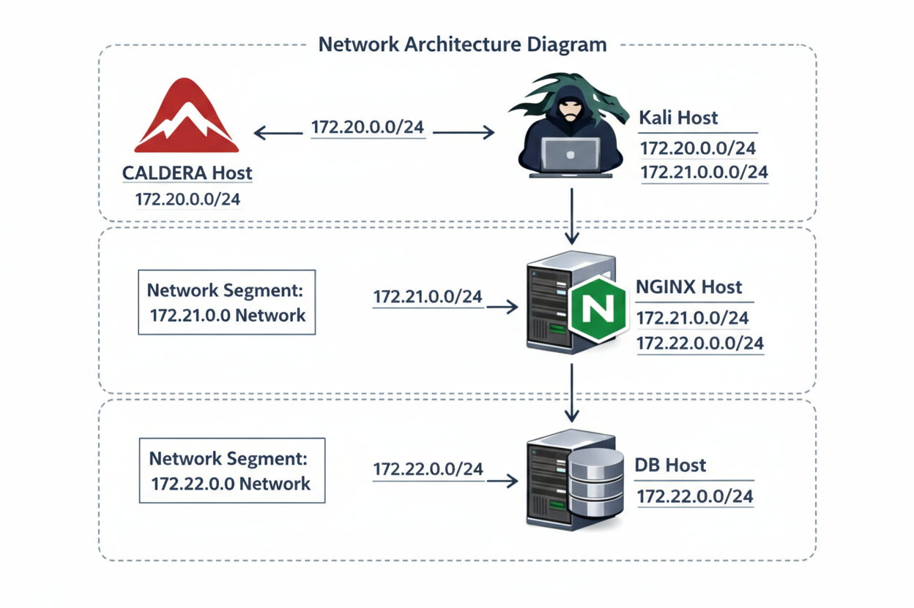
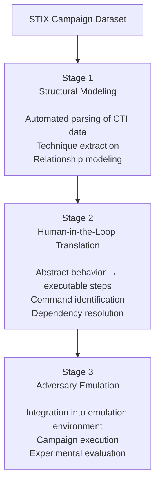

# The Procedural Semantics Gap in ATT\&CK-in-STIX: 
### Measuring Procedural Sufficiency for APT Emulation

## Overview

This repository accompanies the paper:

> **The Procedural Semantics Gap in ATT\&CK-in-STIX: Measuring Procedural Sufficiency for APT Emulation**

It provides an experimental environment to evaluate **procedural completeness of STIX-based threat intelligence** and its ability to reproduce **APT campaign behaviors** in a controlled laboratory environment.

The repository includes:

- A **Docker-based adversary emulation environment**
- Automated generation of attacker commands
- Integration with **MITRE Caldera**
- Tools for evaluating the procedural gaps in structured CTI

---

# Architecture

The environment uses multiple Docker containers connected through static networks.

<p align="center">
  
</p>

---

# Static Network Configuration

| Network | Subnet | Host | IP |
|------|------|------|------|
| caldera-kali-network | 172.20.0.0/24 | caldera | 172.20.0.10 |
| caldera-kali-network | 172.20.0.0/24 | kali | 172.20.0.20 |
| kali-nginx-network | 172.21.0.0/24 | kali | 172.21.0.10 |
| kali-nginx-network | 172.21.0.0/24 | nginx | 172.21.0.20 |
| nginx-db-network | 172.22.0.0/24 | nginx | 172.22.0.10 |
| nginx-db-network | 172.22.0.0/24 | db | 172.22.0.20 |

---

# Repository Structure

```
.
├── architecture.png        # Network architecture diagram
│
├── docker/                 # Docker environment and network configuration
│   ├── docker-compose.yml
│   ├── kali-data/          # Persistent data for Kali container
│   └── .docker/            # Container build contexts
│       ├── caldera/        # MITRE Caldera container
│       ├── db/             # Database container
│       ├── kali/           # Kali attacker container
│       └── nginx/          # Target web server container
│
├── sticks/                 # STIX analysis and campaign generation framework
│   ├── config/             # Configuration files
│   ├── data/               # Dataset and intermediate artifacts
│   ├── lib/                # Core libraries
│   ├── tools/              # Utility scripts
│   ├── main.py             # Main execution entry point
│   ├── requirements.txt    # Python dependencies
│   └── README.md           # STIX framework documentation
```
---

# Requirements

Before running the system, install the required Python dependencies:

```bash
pip install -r requirements.txt
```

---

# Configuration

Open the file:

```
config/config.py
```

and configure the following variables.

## GitHub Token

Insert your GitHub token:

```python
GITHUB_TOKEN = "your_token_here"
```

You can generate one here:

https://github.com/settings/tokens

---

## Optional: Azure Integration

If you want to generate attacker commands using Azure, configure:

```python
AZURE_SECRET_KEY
AZURE_ENDPOINT
AZURE_DEPLOYMENT
```

Otherwise, these fields can remain empty.

---

# Running the Environment

## 1️⃣ Start the Docker infrastructure

```bash
cd docker
docker-compose up --build
```

Wait until all containers are built and running.

---

## 2️⃣ Initialize the STIX environment

Move to the `sticks` directory and run:

```bash
python tools/empty_caldera.py
python main.py init
```

---

# Accessing the Adversary Emulation Platform

Open your browser and navigate to:

```
http://localhost:8888
```

Login credentials:

```
user: red
password: admin
```

Then go to:

```
Operations
```

to observe the running campaigns:
APT41 – DUST
ATT&CK Campaign C0010
ATT&CK Campaign C0026
CostaRicto
Operation MidnightEclipse
Operation Outer Space
Salesforce Data Exfiltration
ShadowRay

---

# Experimental Goal

The purpose of this framework is to:

- Evaluate **structural completeness of STIX CTI datasets**
- Measure the **procedural requirements needed for campaign execution**
- Identify **missing operational knowledge** required to reproduce APT campaigns
- Support **automated adversary emulation experiments**

---

# Experiment Workflow

The framework implements a pipeline that converts **structured CTI (STIX campaigns)** into executable adversary behaviors in a controlled emulation environment.

The workflow is divided into three stages:

- **Stage 1** performs automated structural modeling of CTI data.  
- **Stage 2** introduces a human-in-the-loop translation from abstract behavioral descriptions to minimal executable steps.  
- **Stage 3** integrates these steps into an adversary emulation environment.

The diagram below is **conceptual rather than an implementation diagram** and does not assume any specific serialization.



---

# Stage 1 — Structural Modeling of CTI

In the first stage, the framework performs **automated structural modeling** of cyber threat intelligence data.

The system parses STIX campaign datasets and extracts relevant structural elements, including:

- Techniques  
- Relationships  
- Indicators  
- Infrastructure  
- Malware  
- Campaign metadata  

This process constructs an intermediate representation of the campaign by identifying:

- attack techniques  
- dependencies between actions  
- structural relationships within the campaign  

The result is a **machine-readable model of adversary activity derived directly from CTI data**.

---

# Stage 2 — Human-in-the-Loop Translation

The second stage introduces a **human-in-the-loop translation process**.

Structured CTI often describes adversary behavior at an abstract level (e.g., techniques or tactics) rather than providing precise execution procedures. In this stage, an analyst translates these abstract behavioral descriptions into **minimal executable steps**.

This step includes:

- identifying the concrete commands required to reproduce a technique  
- resolving implicit environmental assumptions  
- defining execution order and dependencies  
- specifying required privileges or infrastructure  

The outcome is a set of **minimal operational procedures** that can be executed by an adversary emulation platform.

---

# Stage 3 — Adversary Emulation

In the final stage, the translated procedures are integrated into an **adversary emulation environment**.

The generated steps are converted into executable components and deployed within a controlled laboratory infrastructure built with Docker containers.

The environment includes multiple hosts representing a simplified enterprise architecture, such as:

- attacker node  
- command and control infrastructure  
- intermediary services  
- backend systems  

Campaign execution is then orchestrated using an adversary emulation platform, allowing the system to observe whether the CTI-derived behaviors can be successfully reproduced.

This stage enables **empirical evaluation of procedural completeness in structured CTI datasets**.

# License
GNU GPLv3.
